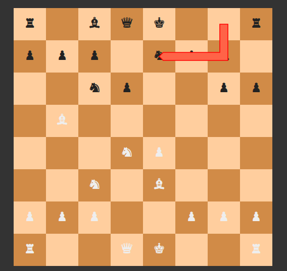

# A browser-based chess app in Gleam/Lustre



All the actual chess logic courtesy of [chess.js](https://github.com/jhlywa/chess.js), which I've shamelessly copied into `./src/` for convenience.

The main purpose of this (besides learning a bit about [Lustre](https://hexdocs.pm/lustre/)) is to be able to play against my own entry in [the Gleam Chess Tournament](https://github.com/isaacharrisholt/gleam-chess-tournament).

Assuming the chess bot is running on port 8000, run the application as follows:

```
gleam run -m lustre/dev start --proxy-from=/move --proxy-to=http://localhost:8000/move
```

Alternatively, add CORS headers to your chess bot implementation.
